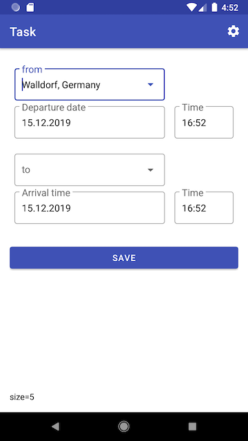

## Requirement:
* Android Studio 3.3+
* Kotlin 

## Jetpack Components
* Room
* LiveData
* ViewModel
* Data binding
* Navigation
* WorkManager

## Library
* [Dagger 2](https://github.com/google/dagger) --- Dependency Injection
* Google Map [Places](https://developers.google.com/places/android-sdk/start) SDK for Android --- Location predication
* [AssistedInject](https://github.com/square/AssistedInject) --- Assistance for Dagger 2
* [Anko](https://github.com/Kotlin/anko)  --- Deprecated just 2 weeks ago
* [Material component Android](https://github.com/material-components/material-components-android)
* [MaterialDateTimePicker](https://github.com/wdullaer/MaterialDateTimePicker)

## MVVM Architecture

## MVVM

* Model: `Trip`

* View: `MainActivity`, `MainFragment`
 
* ViewModel: `MainActivityViewModel`, `MainFragViewModel`

## Screenshot

## synchronization
1. Data is being saved in local database
2. After that, `RemoteService` is going to save data to cloud.
3. If success, update local database, set `inRemote=true`

Every time when the app starts, it starts also a periodic Worker in the background. This Worker search the data which `inRemote=false`, then call `RemoteService` to push data to cloud.

## Improvement
* Internationalization and localization
* Minimum period length of a `PeriodicWorker` is 15 minutes